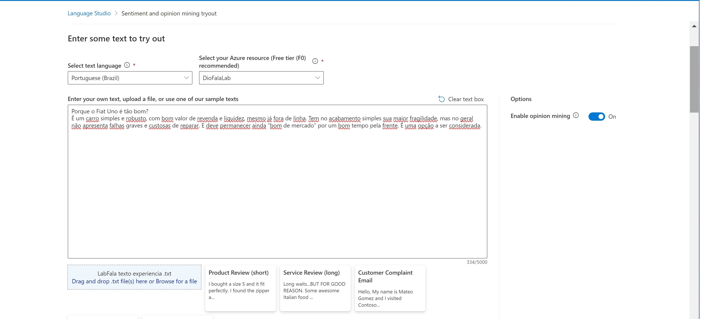
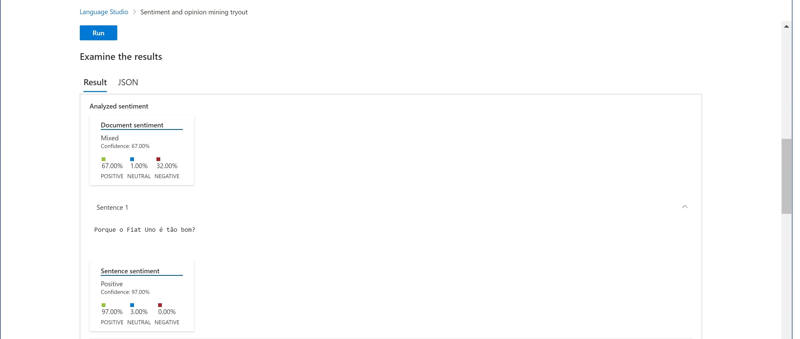
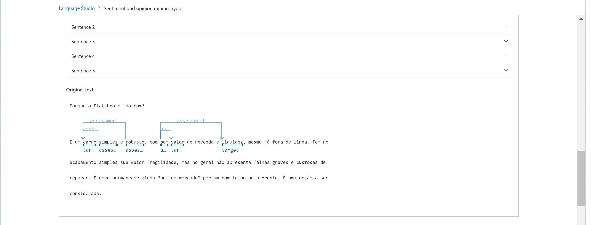

# Language-Studio-no-Azure-AI

Prints e descrição do processo no Language Studio
O primeiro passo é criar um recurso de linguagem (Create a Language resource), no Azure AI services, com sua inscrição Azure.

Configurando para o Visio Studio:
Entrar no portal Azure https://portal.azure.com.
Clicar no botão ＋Create a resource e procure por serviço de idiomas (Language Service). Selecionei "create a Language service plan". Direcionado a uma página para Select additional features. Mantenha a seleção padrão e clique em Continue to create your resource.
Na página Create Language (Criar Idioma), configure-o com as seguintes configurações:
Subscription: Azure subscription 1.
Resource group: LabLang.
Region: East US.
Name: DioFalaLab.
Pricing tier: Standard S0.
Selecinei o check box: "I acknowledge that I have read and understood all the terms below.
Selecionei Review + create then Create e aguardei a implantação se completar.
Configure seu recurso em Azure AI Language Studio
Em outra aba do navegador, abra o Language Studio em https://language.cognitive.azure.com e faça login.

Quando solicitado com Select an Azure resource, faça as seguintes configurações:

Azure directory: Default Directory, the directory you are using
Azure subscription: Select the subscription you are using
Resource type: Language
Resource name: select the Language service resource you just created
Em seguida, selecione Done.
Analise as avaliações em Language Studio
Em um navegador da web, navegue até Language Studio em https://language.cognitive.azure.com.
Na página inicial Welcome to Language Studio, selecione a guia Classify text e, em seguida, selecione o bloco Analyze sentiment and mine opinions.
Em Selecionar idioma do texto, selecione English.
Em Select your Azure resource, selecione o seu recurso.
Em Enter your own text, carregue o arquivo (LabFala-texto-fiat-uno.txt), com o seguinte comentário:
Porque o Fiat Uno é tão bom?

É um carro simples e robusto, com bom valor de revenda e liquidez, mesmo já fora de linha. Tem no acabamento simples sua maior fragilidade, mas no geral não apresenta falhas graves e custosas de reparar. E deve permanecer ainda “bom de mercado” por um bom tempo pela frente. É uma opção a ser considerada.

Marque a caixa para reconhecer que a demonstração incorrerá em uso e poderá incorrer em custos e, em seguida, selecione Run.

>>Revise a saída. Observe que o documento é analisado quanto ao sentimento, assim como cada frase. Selecione a frase 1 para mostrar a análise de sentimento dessa frase.
 

 

[Note]
É interessante notar como a análise liga emtdades e enunciados à intensões, criando um sentido ponderado de uma avaliação. Com o Language Studio pode-se fazer mineração de sentimentos e opiniões, com três trechos de texto...

3.3. Alguns insights e possibilidades que você aprendeu durante o conteúdo após a IA analisar suas sentenças;
O Processamento de Linguagem Natural (PNL) é fundamental para compreender e interagir com a linguagem escrita e falada, possibilitando a extração de significado semântico e a formulação de respostas em linguagem natural.

Agências de Viagens, entre outros serviçoes, podem usar o Azure Language Studio para analisar avaliações de hotéis, identificando sentimentos e entidades mencionadas, melhorando a experiência do cliente.

O Azure Language Studio é uma ferramenta poderosa oferecida pela Microsoft para análise de texto e compreensão de linguagem natural. Uma das aplicações mais significativas do Language Studio é a análise de sentimentos, onde ele pode ser utilizado para determinar se as avaliações de produtos, serviços ou qualquer outro tipo de conteúdo são predominantemente positivas ou negativas. Isso é essencial para empresas que desejam entender o feedback dos clientes e a reputação de sua marca. Ao empregar técnicas de processamento de linguagem natural avançadas, o Language Studio é capaz de identificar nuances no texto, capturando não apenas palavras-chave, mas também o contexto e o tom geral das avaliações.

Através do uso de algoritmos de aprendizado de máquina e modelos de linguagem pré-treinados, o Language Studio é capaz de analisar grandes volumes de avaliações de forma rápida e eficiente. Ele pode detectar palavras e frases que indicam sentimentos positivos ou negativos, levando em consideração aspectos como sarcasmo, ironia e ambiguidade. Isso permite uma avaliação mais precisa e detalhada do sentimento expresso no texto, proporcionando insights valiosos para as empresas.

Uma das vantagens do Azure Language Studio é sua capacidade de personalização. As empresas podem ajustar os modelos de análise de sentimento de acordo com suas necessidades específicas e o domínio de seu negócio. Isso permite uma análise mais precisa e relevante das avaliações, levando em consideração termos e expressões específicas da indústria ou do público-alvo. Além disso, o Language Studio oferece integração com outras ferramentas e serviços do Azure, permitindo uma implementação suave em diferentes sistemas e plataformas.

No entanto, é importante reconhecer que nenhuma ferramenta de análise de sentimento é perfeita. O Azure Language Studio pode enfrentar desafios ao lidar com textos complexos ou ambíguos, onde o contexto pode influenciar significativamente o sentimento expresso. Além disso, como qualquer tecnologia baseada em machine learning, o desempenho do Language Studio pode variar dependendo da qualidade dos dados de treinamento e das configurações específicas utilizadas. Portanto, é fundamental complementar a análise automatizada com revisão humana e outras formas de feedback para obter uma compreensão abrangente das avaliações.

Um outro aspecto importante, que também deve ser consdierado, é a integração dessas ferramentas com os ambientes de navegação na internet, tais como plataformas, sites e aplicativos.

4. Compartilhar o link do repositório através do botão 'entregar projeto'
Antes de finalizar o desafio, uma providência importate é limpar (Clean up) o Language Studio, deletando os recrusos para não gerar custos desnecessários.

Clean up
Como é recomendado na documentção, senão se pretende fazer mais exercícios, excluir todos os recursos que não precisa mais. Isso evita acumular custos desnecessários.
‑

Abra o portal do Azure (https://portal.azure.com/) e selecione o grupo de recursos que contém o recurso que você criou.
Selecione o recurso e selecione Excluir e depois Sim para confirmar. O recurso é então excluído.
Observação: Uma curiosidade que, nesta etapa, a plataforma informou que não houve consumo de recursos, restando ainda um crédito de R$ 988,18, na assinatura gratuita. Foi a mesma posição do último desafio no Azura, Vision Studio: Detect faces; Read text; e, Analyze images.
